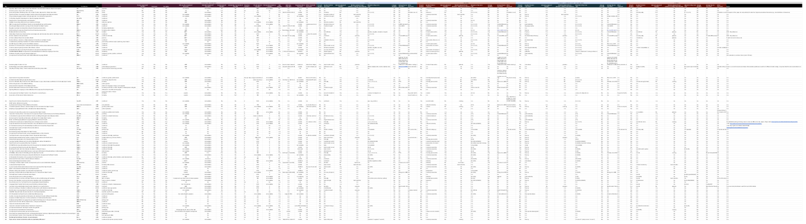

# A Review of Human Evaluation for Style Transfer

This repository contains metadata for the GEM 2021 paper that can be found [here]()!

    

* `ST_review_metadata`: results of human evaluation review;
* `review_criteria_details`: details and examples of annotated criteria;
* `highlighted-pdfs`: papers covered in the review along with highlighted annotations (i.e., yellow and green highlights) corresponding to human evaluation sections.
